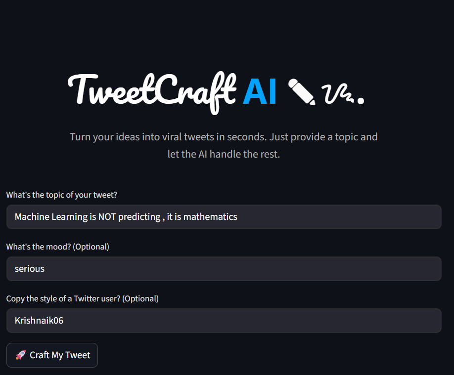

# TweetCraft AI 🤖✍️

Never stare at a blank tweet composer again! TweetCraft AI is a powerful, AI-driven application designed to help you craft engaging and viral-worthy tweets effortlessly. Simply provide a topic, and our intelligent multi-agent system will generate, critique, and refine a tweet for you.

## 🚀 Try the Live App!

### [➡️ Click Here to Launch TweetCraft AI ⬅️](https://tweetcraftai.streamlit.app)

## ✨ Key Features

-   **📝 Instant Tweet Generation:** Get high-quality tweets from just a simple topic or idea.
-   **🎭 Mimic Any Influencer's Style:** This is the special part! Want to tweet like `@naval` or any other creator? Just enter their username (without the @), and the AI will adopt their unique writing style for your topic.
-   **🎨 Mood & Tone Control:** Customize the vibe of your tweet by specifying a mood, like Funny, Inspirational, or Sarcastic.
-   **🔄 Self-Optimizing Workflow:** Uses a sophisticated `generate -> evaluate -> optimize` loop. An AI critic reviews the tweet and provides feedback, which another AI then uses to improve the content.
-   **🚀 Powered by Modern AI:** Built using Python, Streamlit, LangGraph, and state-of-the-art LLMs from Hugging Face.

## 💡 How It Works

TweetCraft AI isn't just a simple text generator. It employs a graph-based agentic workflow:

1.  **Generator Agent:** Creates the first draft of the tweet based on your inputs (topic, mood, and style).
2.  **Evaluator Agent:** Acts as a harsh critic, checking the tweet for engagement potential and providing constructive feedback.
3.  **Optimizer Agent:** Rewrites the tweet based on the critic's feedback to make it better.

This cycle repeats to ensure the final output is polished, catchy, and ready to be posted!

## 🖼️ TweetCraft GUI

